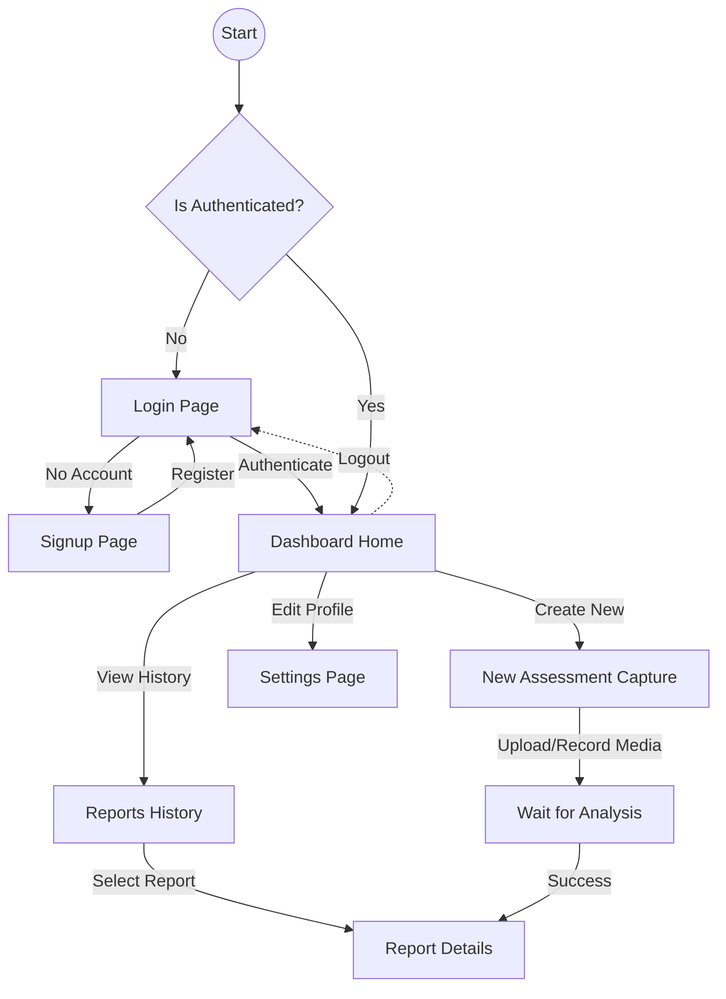
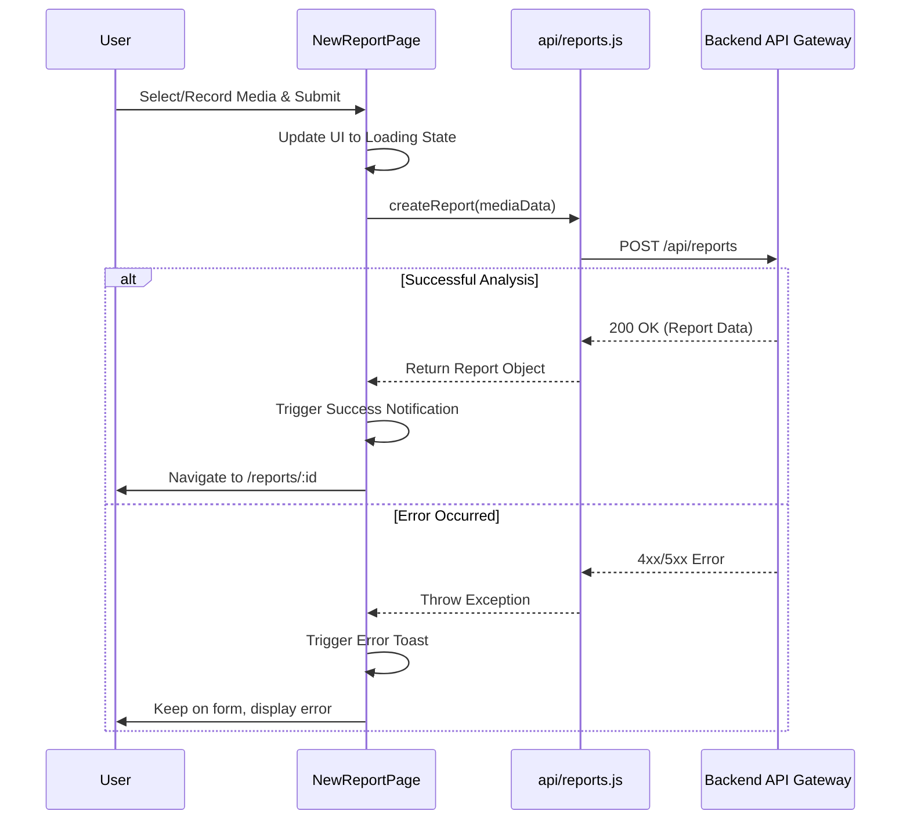

# E-VEDA Frontend

This is the React-based frontend application for the E-VEDA (Integrated AI-Powered Mental State Assessment Platform). It provides a responsive, modern, and interactive user interface for authenticating users, capturing media (audio/video), interacting with the AI analysis pipeline, and displaying comprehensive mental state reports.

## Technologies Used

- **Framework:** [React 19](https://react.dev/) with [Vite](https://vitejs.dev/)
- **Routing:** [React Router v7](https://reactrouter.com/)
- **Styling:** [Tailwind CSS](https://tailwindcss.com/) & [CoreUI for React](https://coreui.io/react/)
- **Animations:** [Framer Motion](https://www.framer.com/motion/)
- **Charts:** [Chart.js](https://www.chartjs.org/) via `@coreui/react-chartjs`
- **Notifications:** [Sonner](https://sonner.emilkowal.ski/)
- **HTTP Client:** [Axios](https://axios-http.com/)
- **PDF Generation:** [html2pdf.js](https://ekoopmans.github.io/html2pdf.js/)

## Project Structure

```text
Frontend/
├── public/                 # Static assets (favicon, etc.)
├── src/
│   ├── api/                # Axios configuration and API service functions (auth, user, ai, reports)
│   ├── assets/             # Images, fonts, and other local assets
│   ├── components/         # Reusable UI components (Header, SideBar, dashboard widgets)
│   ├── layouts/            # Page layouts (AuthLayout for login/signup, DashboardLayout for logged-in view)
│   ├── pages/              # Main route components
│   │   ├── LoginPage.jsx
│   │   ├── SignupPage.jsx
│   │   ├── DashboardPage.jsx
│   │   ├── reports/        # New report capture, report history, and detailed report views
│   │   └── settings/       # User profile and preferences
│   ├── utils/              # Helper functions and utilities
│   ├── App.jsx             # Root component defining React Router routes
│   ├── index.css           # Global CSS and Tailwind directives
│   └── main.jsx            # Application entry point
├── eslint.config.js        # ESLint configuration
├── tailwind.config.js      # Tailwind CSS configuration
└── vite.config.js          # Vite configuration
```

## Features

- **Modern Authentication Flow:** Smooth login and signup flows using Framer Motion side-by-side layouts.
- **Dashboard & Navigation:** Integrated CoreUI sidebar and responsive header for easy navigation.
- **Media Capture:** User interfaces for securely recording or uploading audio and video inputs for AI assessment.
- **Interactive Reports:** Detailed data visualization of mental state metrics using Chart.js.
- **Export to PDF:** Ability to download detailed mental state reports directly from the browser.
- **Toasts & Notifications:** Real-time feedback using Sonner toast notifications.

## Application Flows

### User Navigation Flow
This flowchart maps how a user moves through the E-VEDA frontend application.



### Execution Flow: Assessment Creation
This sequence diagram illustrates the internal frontend execution flow when a user submits a new mental state assessment.



## Getting Started

### Prerequisites

- Node.js (v18 or higher recommended)
- npm, yarn, or pnpm

### Installation

1. Navigate to the `Frontend` directory:
   ```bash
   cd Frontend
   ```
2. Install the dependencies:
   ```bash
   npm install
   ```

### Running the Development Server

Start the Vite development server with Hot Module Replacement (HMR):

```bash
npm run dev
```

The application will typically be available at `http://localhost:5173`.

### Building for Production

To build the application for production:

```bash
npm run build
```

This will generate an optimized build in the `dist` folder. To preview the production build locally:

```bash
npm run preview
```

## Environment Configuration

Ensure that your frontend is pointing to the correct API Gateway backend. You can define environment variables using a `.env` file in the root of the `Frontend` directory (e.g., `.env.local` or `.env.development`). 

Example:
```env
VITE_API_BASE_URL=http://localhost:8080/api
```
*(Check `src/api/config.js` to see exactly which environment variables are being read).*

## Code Quality

This project enforces code quality through ESLint. You can manually run the linter using:

```bash
npm run lint
```
