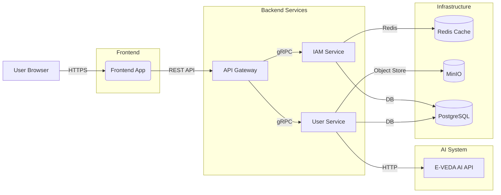
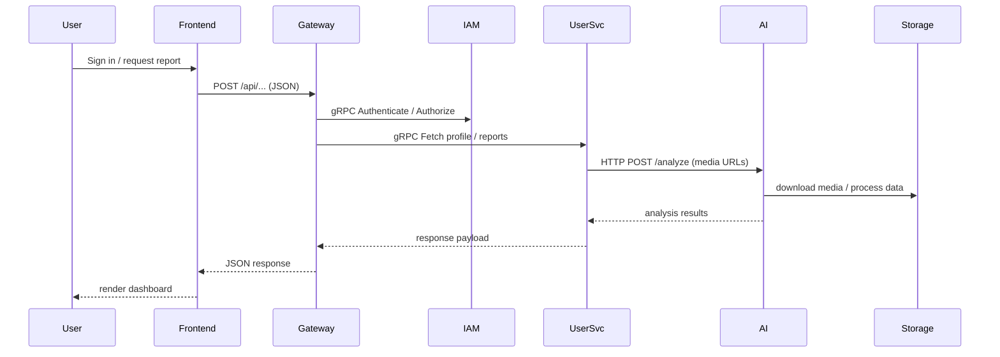
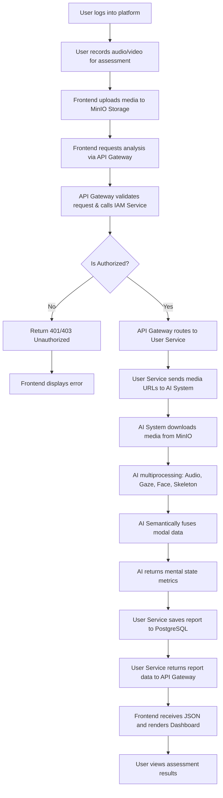

# E-VEDA

E-VEDA is an integrated AI-powered mental state assessment platform for education and healthcare. It combines a React/Vite web frontend, Go-based microservices backend, and a Python multimodal AI system that analyzes audio and video to infer emotion, attention, and stress.

> **BE Computer Final Year Project** by Students of **Keystone School of Engineering, Pune, IN**
> Under the guidance of **Prof. Vrushali Wankhade**

## Project Members

1. **Ansh Sharma** [Project Lead]
2. **Divesh Sonawane** [AI System Developer]
3. **Shreeyash Shinde** [Frontend Developer]
4. **Srushti Shinde** [UI/UX Designer + Frontend Developer]

### Module Contributors

- **AI System**: Divesh Sonawane and Ansh Sharma
- **Frontend**: Shreeyash Shinde, Srushti Shinde, and Ansh Sharma
- **Backend**: Ansh Sharma

## Project Overview

- **Frontend**: React with Vite for responsive UI, user authentication, report generation, and dashboard interactions.
- **Backend**: Go microservices in a gRPC architecture with an API gateway, Redis cache, MinIO object storage, and PostgreSQL compatibility.
- **AI System**: FastAPI-based multimodal analysis module that processes audio, facial, gaze, and skeletal data to produce semantic mental state predictions.

## Architecture



### Data Flow



### Full Execution Flow



## Repository Structure

```text
E-VEDA/
├── Backend/          # Go microservices backend and Docker compose orchestration
├── Frontend/         # React + Vite web client
├── aiSystem/         # Python FastAPI multimodal AI inference system
└── README.md         # Root project documentation
```

## Key Features

- Multimodal emotion and mental state fusion using audio, facial, gaze, and skeletal signals.
- Modern frontend using React, Tailwind, and CoreUI components.
- Microservices architecture with API gateway and gRPC service contracts.
- Dockerized local development with Redis, MinIO, and backend containers.
- AI integration for semantic report generation and educational insights.

## Getting Started

### Prerequisites

- Docker & Docker Compose
- Node.js (v18+ recommended)
- npm (for `frontend`)
- Python 3.10 (for `aiSystem`)
- Optional: Go 1.20+ (for `backend`)

### Frontend Setup

```bash
cd Frontend
npm install
npm run dev
```

Open the app in your browser at the URL displayed by Vite.

### Backend Setup

```bash
cd Backend
# Recommended: set environment variables in a .env file
docker compose up --build -d
```

If the repository includes a `Makefile`, you can also use:

```bash
cd Backend
make up
```

### AI System Setup

```bash
cd aiSystem
python -m pip install -r requirements.txt
python api.py
```

The AI API listens on `http://0.0.0.0:8000` by default.

## Important Ports

| Service | Default Local Port |
|---|---|
| Frontend (Vite) | `5173` |
| API Gateway | `8080` |
| IAM Service gRPC | `50052` |
| User Service gRPC | `50051` |
| Redis | `6379` |
| MinIO API | `9000` |
| MinIO Console | `9001` |
| AI System | `8000` |

## Subproject Documentation

- `Backend/README.md` — Backend architecture, microservice details, and Docker instructions.
- `aiSystem/README.md` — Multimodal AI API usage, inference flow, and model details.
- `Frontend/` — React app configuration and available scripts in `package.json`.

## Notes

- The `Backend/docker-compose.yml` orchestrates the microservice stack and storage dependencies.
- `aiSystem` uses local model files stored under `aiSystem/models/` for audio, gaze, and facial inference.
- The `Frontend` is designed to connect to the backend API gateway, so ensure the gateway is running when testing the UI.

## Contributing

1. Fork the repository and create a feature branch.
2. Open a pull request against the current branch.
3. Add or update documentation for any major changes.
4. Run formatting, linting, and tests where applicable.

## License

This project is licensed under the MIT License. See [LICENSE](LICENSE) for details.
