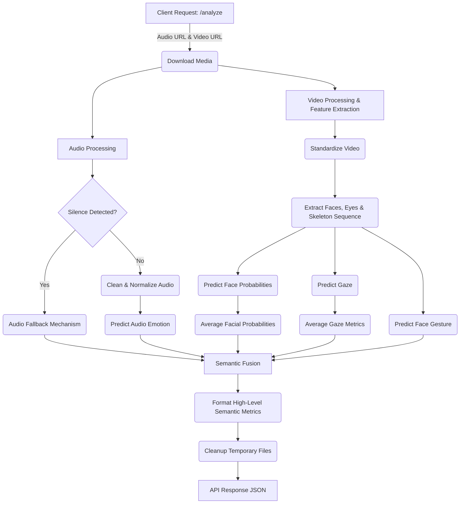

# E-VEDA Multimodal AI System API

## Overview

The **E-VEDA System API Module** provides a RESTful interface for the E-VEDA multimodal emotion and mental state analysis system. Built with FastAPI, it orchestrates the entire pipeline for analyzing media by downloading audio and video files from URLs, preprocessing them, performing parallel inferencing across various deep learning models, and fusing the results to return a comprehensive mental state assessment.

## Directory Structure

- `input/`: Contains modules for capturing raw data (used more directly in the real-time system, but contextually relevant).
- `features/`: Contains feature extraction logic (e.g., pose dynamics).
- `prediction/`: Contains the predictive models.
  - `predict_audio.py`: Scores acoustic emotion from audio files.
  - `predict_face_gest.py`: Predicts face gestures using facial data and extracted skeleton sequences.
  - `predict_face_prob.py`: Generates facial probabilities.
  - `predict_gaze.py`: Visual gaze tracking utilizing face, left eye, and right eye data.
- `fusion/`: Contains the logic for integrating multimodal streams.
  - `fusion_model.py`: Merges the modality streams (audio, face, gaze) to generate a unified prediction.
- `utils/`: Utilities for handling system output and edge cases.
  - `audio_fallback.py`: Provides fallback mechanisms for silent or unreadable audio.
- `audio_preprocessor.py` & `video_preprocessor.py`: Modules responsible for cleaning and standardizing the downloaded media before inferencing.

## Execution Flow (`api.py`)

The main entry point for the API is `api.py`. When a request is made to the `/analyze` endpoint, the following steps are executed:

1. **Request Reception:** Accepts an `AnalysisRequest` containing `audio_url` and `video_url`.
2. **Download:** Downloads the audio and video files locally to temporary paths.
3. **Audio Processing:**
   - Detects silence to ensure robustness against empty or corrupted audio.
   - If silent, uses a fallback mechanism (`make_silent_audio_result`).
   - Otherwise, cleans/normalizes the audio and extracts acoustic emotion via `predict_audio_emotion`.
4. **Video Processing & Feature Extraction:**
   - Standardizes the downloaded video.
   - Iterates through frames to extract face crops, left eye crops, right eye crops, and temporal skeleton (pose) features via MediaPipe.
5. **Visual Inferencing:**
   - Evaluates each extracted face crop for probabilities (`predict_face_prob`) and gaze (`predict_gaze`).
   - Averages the facial probabilities and gaze metrics across the extracted frames.
   - Predicts facial gestures based on a representative crop and the skeleton sequence (`predict_face_gesture`).
6. **Semantic Fusion:** Merges the separate modality streams (audio, face, gaze) via the fusion model to compute an overall emotion and attention score.
7. **Metric Formatting:** Derives and formats higher-level semantic metrics (primary/secondary emotions, eye movement, voice tension, blink frequency, system accuracy) for the API response.
8. **Cleanup:** Removes the temporary downloaded and cleaned media files from the server.

### Execution Flow Diagram



## Usage

To start the E-VEDA API System, run the script from the root of the project:

```bash
python api.py
```

This will launch a Uvicorn server hosting the FastAPI application on `http://0.0.0.0:8000`.

### API Endpoints

#### `POST /analyze`

Analyzes the provided audio and video URLs and returns a comprehensive mental state assessment.

**Request Body (JSON):**

```json
{
  "audio_url": "https://example.com/path/to/audio.wav",
  "video_url": "https://example.com/path/to/video.mp4"
}
```

**Response (JSON):**

```json
{
  "emotion_1_name": "Happy",
  "emotion_1_rating": 0.85,
  "emotion_2_name": "Neutral",
  "emotion_2_rating": 0.12,
  "eye_movement": "Steady",
  "voice_tension": "Relaxed",
  "blink_frequency": "Normal",
  "accuracy_rate": 0.93,
  "confidence_rate": 0.85
}
```

## Requirements

Ensure all necessary dependencies are installed before running the API. Refer to the `requirements.txt` file for the exact package versions needed.

```bash
pip install -r requirements.txt
```